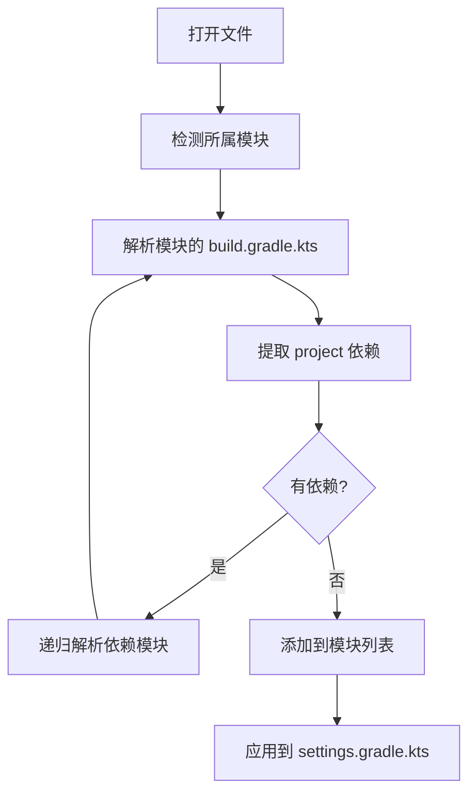

# 递归依赖推导功能

## 功能概述

在按需模块加载功能中，现在支持递归推导模块的依赖。当你打开一个文件时，插件不仅会加载该文件所在的模块，还会自动加载该模块依赖的所有模块。

## 工作原理



## 支持的依赖格式

### 1. 标准 project() 格式

```kotlin
dependencies {
    implementation(project(":lib:tool-swing"))
    api(project(":lib-git:metaprogramming-lsi:lsi-core"))
    testImplementation(project(":lib:test-utils"))
}
```

### 2. Type-safe Project Accessors 格式

```kotlin
dependencies {
    implementation(projects.lib.toolSwing)
    api(projects.checkouts.metaprogrammingLsi.lsiCore)
}
```

## 支持的依赖配置

插件支持以下所有 Gradle 依赖配置类型：

- `implementation`
- `api`
- `compileOnly`
- `runtimeOnly`
- `testImplementation`
- `testCompileOnly`
- `testRuntimeOnly`
- `annotationProcessor`
- `kapt`
- `ksp`

## 递归算法

使用广度优先搜索（BFS）算法来避免无限递归和重复处理：

```kotlin
fun expandWithDependencies(project: Project, modules: Set<String>): Set<String> {
    val result = mutableSetOf<String>()
    val visited = mutableSetOf<String>()
    val queue = modules.toMutableList()
    
    while (queue.isNotEmpty()) {
        val modulePath = queue.removeFirst()
        if (modulePath in visited) continue
        
        visited.add(modulePath)
        result.add(modulePath)
        
        // 解析此模块的依赖
        val dependencies = extractProjectDependencies(project, modulePath)
        dependencies.forEach { dep ->
            if (dep !in visited) {
                queue.add(dep)
            }
        }
    }
    
    return result
}
```

## 特殊处理

### 1. 注释过滤

插件会自动忽略被注释掉的依赖：

```kotlin
dependencies {
    implementation(project(":lib:active"))
    // implementation(project(":lib:ignored"))  // 这个会被忽略
}
```

### 2. 循环依赖检测

通过 `visited` 集合来防止循环依赖导致的无限递归。

### 3. 文件查找

支持 `build.gradle.kts` 和 `build.gradle` 两种构建文件。

## 使用示例

### 场景：打开 AutoDDL 插件中的文件

1. 打开文件：`plugins/autoddl/src/main/kotlin/SomeClass.kt`
2. 检测到模块：`:plugins:autoddl`
3. 解析依赖：
   - `:lib-git:metaprogramming-lsi:lsi-core`
   - `:lib-git:metaprogramming-lsi:lsi-intellij`
   - `:lib-git:metaprogramming-lsi:lsi-psi`
   - `:lib-git:metaprogramming-lsi:lsi-kt`
   - `:lib:tool-swing`
   - `:lib:tool-awt`
   - `:lib:tool-psi-toml`
   - `:lib:ide-component-settings-old`
4. 递归解析每个依赖模块的依赖
5. 最终生成完整的模块列表并应用到 `settings.gradle.kts`

## 性能考虑

- 使用缓存避免重复文件读取
- BFS 算法确保每个模块只处理一次
- 文件读取错误不会中断整个流程，只会记录警告日志

## 已知限制

1. **Type-safe accessors 命名转换**：
   - `tool-awt` 在 accessor 中是 `toolAwt`
   - 转换回模块路径时需要注意 kebab-case 和 camelCase 的对应关系
   - 当前实现直接将 `.` 替换为 `:`，可能在某些复杂命名情况下不准确

2. **动态依赖**：
   - 不支持通过变量或函数动态生成的依赖
   - 只支持静态声明的依赖

## 未来改进

- [ ] 支持更智能的 Type-safe accessors 转换
- [ ] 支持依赖版本冲突检测
- [ ] 可视化依赖树
- [ ] 支持排除特定依赖的递归
