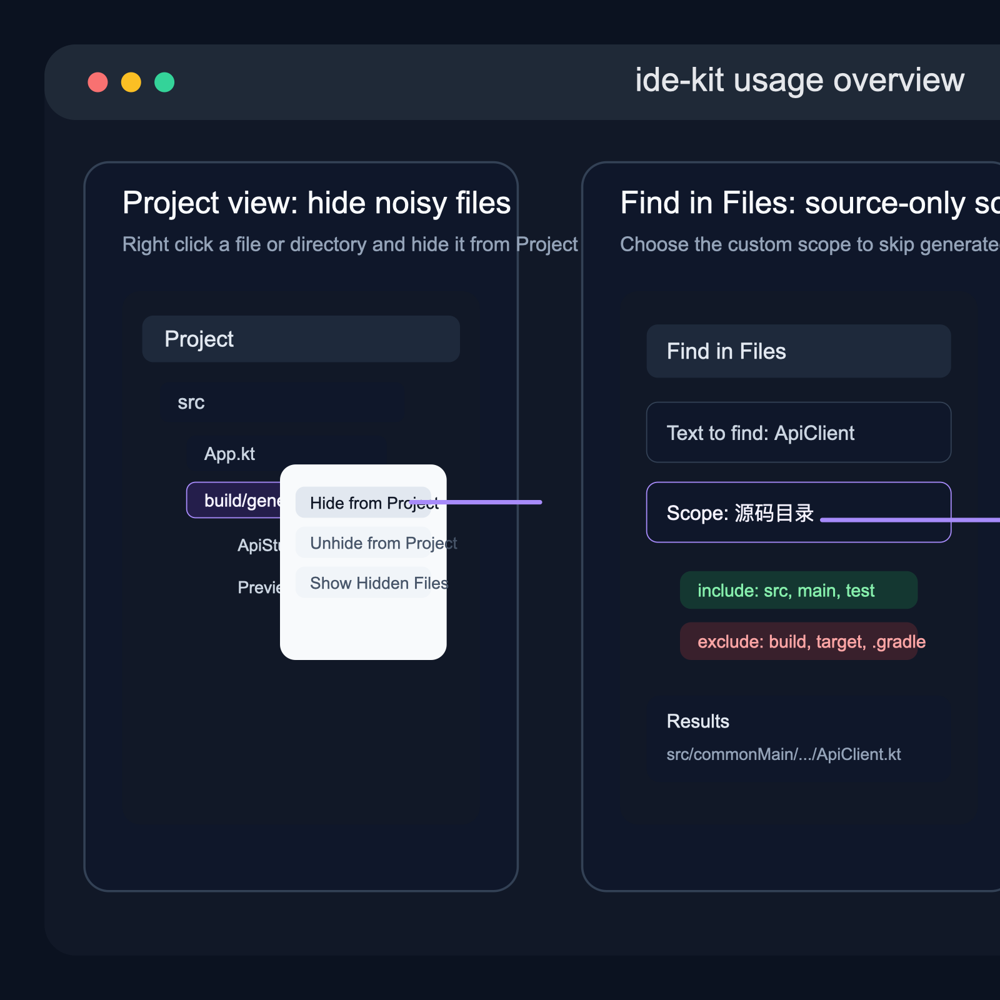

# ide-kit packages Kotlin cleanup, source-only search, and project file hiding tools for JetBrains IDEs.

`ide-kit` 是一个面向 JetBrains IDE 的轻量效率插件，当前聚焦三类高频场景：

- Kotlin 属性的冗余显式类型清理
- Kotlin `class` / `data class` 转 `interface`
- Find in Files 里的“源码目录”搜索范围
- Project 视图与 VCS 提交列表里的文件隐藏能力

## 功能一览

- `Alt+Enter` 意图动作：对 Kotlin 属性提供 `移除冗余显式类型`
- `Alt+Enter` 意图动作：对简单 Kotlin `class` / `data class` 提供 `转换为 interface`
- Kotlin Inspection：自动标出可以安全删掉的冗余显式类型声明
- 搜索范围：在 `Find in Files` 中增加“源码目录” scope，排除常见生成目录
- 全局搜索降噪：自动把各模块下的 `.gradle` / `.kotlin` / `.gradle-user-home` / `build/tmp` 生成目录排除出项目索引
- Project 视图隐藏：右键隐藏选中的文件或目录
- 隐藏项显示切换：在 Project 视图工具栏切换是否显示已隐藏文件
- Module Lock：按模块临时收起稳定功能模块，不影响 Gradle 构建
- VCS 提交列表联动：隐藏项会同步从提交变更列表中排除

## 适合谁用

- Kotlin 项目里经常需要清理样板类型声明的开发者
- 习惯先写数据承载类，后续又想把契约抽成接口的 Kotlin 开发者
- 想把 `build/`、`target/`、`.gradle/`、`generated/` 等目录排除出全文搜索的人
- 想临时把噪音文件从 Project 视图和变更提交面板里收起来的人
- 想把一批暂时不用动的稳定模块先收起来，集中盯当前功能的人

## 安装后怎么用

### 1. 清理 Kotlin 冗余显式类型

当 Kotlin 已经能安全推断属性类型时，`ide-kit` 会提供 inspection 和 `Alt+Enter` 修复。

使用方式：

1. 打开 Kotlin 文件，把光标放到属性声明上
2. 如果该类型可安全移除，IDE 会显示弱提示
3. 按 `Alt+Enter`
4. 选择 `移除冗余显式类型`

示例：

```kotlin
val userName: String = "zjarlin"
val retryCount: Int = 3
```

执行后：

```kotlin
val userName = "zjarlin"
val retryCount = 3
```

如果你想整仓处理，而不是一个个按 `Alt+Enter`：

1. 打开 `Code -> Inspect Code...`
2. 作用域选择整个项目、模块，或自定义目录
3. 运行后筛选 `SmartRedundantExplicitType`
4. 直接执行批量修复

### 2. 把 Kotlin class / data class 转为 interface

当一个 Kotlin 类型本质上只是“属性契约”时，可以直接在类声明上用 `Alt+Enter` 转成 `interface`。

使用方式：

1. 打开 Kotlin 文件，把光标放到 `class` 或 `data class` 声明上
2. 按 `Alt+Enter`
3. 选择 `转换为 interface`

示例：

```kotlin
data class S3Config(
    val endpoint: String,
    val region: String,
    val bucket: String,
    val accessKey: String,
    val secretKey: String,
)
```

执行后：

```kotlin
interface S3Config {
    val endpoint: String
    val region: String
    val bucket: String
    val accessKey: String
    val secretKey: String
}
```

当前这条意图是保守转换，只会在“能稳定生成合法接口”的场景出现。下面这些情况暂时不会提供该意图：

- 有 `init` 块
- 有次构造函数
- 主构造参数里存在非 `val` / `var` 参数
- 存在父类构造调用，例如 `: Base()`
- 类体里声明了普通属性

### 3. 在 Find in Files 里只搜源码

`ide-kit` 不再偷偷改写默认搜索范围，而是显式提供一个可选的“源码目录” scope。

另外，插件会自动把各模块下的 `.gradle`、`.kotlin`、`.gradle-user-home` 和 `build/tmp` 目录从项目索引里排除，避免 `在项目(P)` 的全局搜索把 Gradle 生成脚本、版本目录访问器源码和缓存结果混进来。

使用方式：

1. 打开 `Edit -> Find -> Find in Files`
2. 在范围选择器里切到 `源码目录`
3. 输入搜索词并执行搜索

这个 scope 会优先保留 source root 下的内容，并排除常见生成输出目录，例如：

- `build`
- `out`
- `target`
- `.gradle`
- `generated`
- `log`
- `logs`
- `*.log`

### 4. 在 Project 视图里隐藏文件或目录

`ide-kit` 提供的是“项目内隐藏”，不是删除、移动或写 `.gitignore`。

隐藏方式：

1. 在 `Project` 视图中选中一个或多个文件/目录
2. 右键
3. 选择 `隐藏 / Hide from Project`

恢复显示方式：

1. 在 `Project` 工具栏打开 `显示隐藏文件 / Show Hidden Files`
2. 找到之前隐藏的文件或目录
3. 右键选择 `取消隐藏 / Unhide from Project`

补充说明：

- 隐藏项会同步从 VCS 提交列表里排除
- 隐藏状态按项目保存，在当前项目的 workspace state 中持久化
- 打开“显示隐藏文件”只是在当前项目里临时显示，不会丢失隐藏标记

### 5. 用 Module Lock 暂时收起稳定模块

`Module Lock` 面向的是模块级收纳，不是文件级隐藏。

使用方式：

1. 在 `Project` 视图里选中某个模块目录，或选中模块中的任意文件
2. 右键选择 `锁定模块 / Lock Module`
3. 该模块会从 `Project` 视图中暂时收起

恢复方式：

1. 在 `Project` 工具栏打开 `显示已锁定模块 / Show Locked Modules`
2. 选中目标模块
3. 右键选择 `取消锁定模块 / Unlock Module`

补充说明：

- 这是显示层收纳，不会改 Gradle 配置
- 不会影响模块构建、依赖解析或同步
- 状态按项目保存在 workspace 中，适合“这几天先别看这些稳定模块”的场景

## 示意截图

下面这张图展示了插件当前文档里提到的主要入口，包括 Kotlin 的 `Alt+Enter` 清理、`Find in Files` 的“源码目录”范围，以及 Project 视图里的隐藏文件操作。



## 当前限制

- Kotlin 清理能力当前面向属性显式类型声明，不是对所有 Kotlin 类型标注做批量重写
- `class -> interface` 当前只覆盖保守场景，不会尝试自动迁移 `init`、次构造、父类构造调用或类体属性
- “源码目录”是显式可选 scope，不会强制覆盖 IDE 默认搜索行为
- `在项目(P)` 的全局搜索会自动少掉 `.gradle` / `.kotlin` / `.gradle-user-home` / `build/tmp` 里的 Gradle 生成脚本和访问器源码，但不会替代你手动配置的自定义 scope
- 隐藏文件能力作用于当前项目视图与变更列表，不会修改磁盘文件，也不会改 Git 跟踪状态
- Module Lock 当前作用于 Project 视图显示层，不会改变 Gradle 构建和模块依赖关系
- 如果团队共享同一个仓库但各自 IDE 视图偏好不同，隐藏状态不会替代团队级规则文件

## 开发（本仓库）

- 插件根模块：`plugins/ide-kit`
- 插件描述：`plugins/ide-kit/src/main/resources/META-INF/plugin.xml`
- Kotlin 清理实现：`plugins/ide-kit/smart-intentions-kotlin-redundant-explicit-type`
- `class -> interface` 实现：`plugins/ide-kit/smart-intentions-kotlin-class-to-interface`
- 搜索 scope 实现：`plugins/ide-kit/smart-intentions-find-source-only`
- 隐藏文件实现：`plugins/ide-kit/smart-intentions-hidden-files`

构建插件：

```bash
./gradlew :plugins:ide-kit:buildPlugin
```
